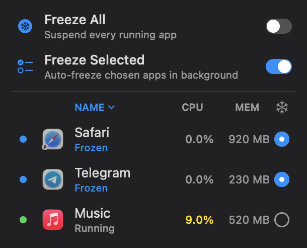

# AppFreeze Pro — лендинг и воронка

Минималистичная посадочная страница ([index.html](index.html)) для воронки
App Store (Lite) ➔ Web (Pro). Полная стратегия — в [../docs/ТЗ-Lite.md](../docs/ТЗ-Lite.md).

## Деплой

**Источник правды** — эта папка `landing/` в репо кода `kolocim/AppFreeze`.
**Живой сайт** — `https://metaflowlabdev.github.io/landing/`, отдаётся из публичного
репо `metaflowlabdev/landing` (GitHub Pages, файлы в корне).

После апрува правок сайта:
1. Закоммитить `landing/*` в `kolocim/AppFreeze`, `git push`.
2. `gh auth switch --user metaflowlabdev`
3. `gh repo clone metaflowlabdev/landing /tmp/landing-deploy`, скопировать
   изменённые файлы поверх (в корень), сверить `diff`, commit, `git push`.
4. `gh auth switch --user kolocim`, удалить `/tmp/landing-deploy`.

> Таблицу сравнения фич держать в синхроне с [../docs/FEATURES.md](../docs/FEATURES.md).

## Как это связано с приложением

В коде Lite зашит **только** короткий редирект `ProUpsell.storeURL`
(сейчас `https://dub.sh/appfreeze-pro`). Цепочка:

```
кнопка в Lite → https://dub.sh/appfreeze-pro (Dub.co)
   → этот лендинг (GitHub Pages)
      → Setapp (подписка)  |  Lemon Squeezy (разовая лицензия)
```

Адрес лендинга можно менять в панели Dub.co без обновления приложения.

## Что подставить (плейсхолдеры в index.html)

- **Setapp** — `href` кнопки «Open in Setapp» → реальный URL приложения в каталоге.
- **Lemon Squeezy** — `href` кнопки «Buy lifetime license» → checkout/buy-URL продукта.
- Цена `$4.99` — при необходимости поправить.

## Скриншоты Pro (секция «What AppFreeze Pro does»)

Секция функционала ждёт **retina (2×) PNG** в `landing/img/`. Пока их нет — на
странице показаны пунктирные плейсхолдеры с именем нужного файла.

Нужные файлы:

| Файл | Что снять |
|------|-----------|
| `img/switch-apps.png` | клик по строке выводит приложение вперёд / сворачивает |
| `img/freeze-toggles.png` | верх панели: свитчи Freeze All / Freeze Selected |
| `img/smart-mode.png` | приложение размораживается при фокусе / морозится при уходе |
| `img/energy-monitor.png` | строка с %CPU и точкой Low/Med/High |
| `img/shortcut-login.png` | меню «Shortcut» / «Launch at Login» |
| `img/safety.png` | защищённые: активное приложение / Finder / системные |

### Как снять в высоком разрешении

> ⚠️ Поповер строки меню нельзя открыть скриптом и нельзя снять офлайн-рендером
> (`ImageRenderer` рисует нативные свитчи заглушками). Снимаем живьём.

1. Собрать и запустить **Pro** (без песочницы):
   ```bash
   xcodebuild -project AppFreeze.xcodeproj -scheme AppFreeze \
     -configuration Debug -destination 'platform=macOS' -derivedDataPath build build
   open build/Build/Products/Debug/AppFreeze.app
   ```
2. Кликнуть иконку в строке меню — открыть панель.
3. Снять **окно** панели в retina (на Retina-маке масштаб 2× автоматически),
   без тени:
   ```bash
   screencapture -i -o ~/Desktop/shot.png
   # нажать ПРОБЕЛ (режим окна) → кликнуть по панели
   ```
4. Положить файл в `landing/img/` под нужным именем из таблицы.
5. В `index.html` заменить плейсхолдер на картинку:
   ```html
   <div class="shot"></div>
   ```

Рекомендация: ширина исходника ≥ 700 px (панель ~250 pt × 2–3×). CSS сам
впишет по ширине колонки, retina-чёткость сохранится.

## Деплой на GitHub Pages

Сайт живёт в отдельном **публичном** репо `metaflowlabdev/landing` (аккаунт
`metaflowlabdev`, НЕ kolocim), Pages раздаёт из `main`/корня. Источник правды —
эта папка `landing/` в основном (kolocim) репо; деплой = скопировать файлы в клон
и запушить под вторым аккаунтом:

```bash
gh auth switch -u metaflowlabdev
TMP=$(mktemp -d); gh repo clone metaflowlabdev/landing "$TMP/site"
# Зеркалим ВСЮ папку (rsync --delete), чтобы новые файлы (напр. appfreeze-docs.html,
# новые img/) не потерялись и удалённые удалились. Тестовую папку test/ не публикуем.
rsync -a --delete --exclude '.git' --exclude 'test' ./ "$TMP/site/"
cd "$TMP/site" && git add -A && git commit -m "update" && git push origin main
gh auth switch -u kolocim
```

Живой адрес: **https://metaflowlabdev.github.io/landing/**
(старый хост `metaflowlabdev/appfreeze` выведен из эксплуатации).

## Тема (`theme.js`) и подводные камни

`theme.js` — общая шапка/футер + переключатель темы для всех страниц. Подключать с
версией для кэш-баста (`theme.js?v=N`, бампить при правке) и давать пустой `<footer>`.

- **Переключатель темы делает `display:none`-реплейнт** (фикс iOS Safari, который
  иначе перекрашивает только видимую часть) и восстанавливает скролл. **Если страница
  использует `html { scroll-behavior: smooth }`** (как `appfreeze-docs.html` для якорей
  сайдбара), восстановление скролла будет **анимироваться от верха → видимый «прыжок
  вверх и обратно»**. Поэтому `theme.js` на время восстановления принудительно ставит
  `scroll-behavior:auto`. Не убирать это — иначе баг вернётся на любой smooth-странице.
- Регрессионный тест: `landing/test/theme-toggle-scroll.test.html` — открыть в браузере
  (вкладка должна быть **активной**: фоновые вкладки тормозят таймеры), внизу слева
  должно быть зелёное **PASS**. Тест грузит реальный `theme.js` (cache-busted), скроллит
  вниз, жмёт тоггл и проверяет, что скролл не ушёл к верху. Папку `test/` в паблик-репо
  не деплоим.

## Настройка «вечного» редиректа (Dub.co)

1. Завести короткую ссылку с тем же slug, что в `ProUpsell.storeURL`
   (`appfreeze-pro`), указывающую на URL Pages.
2. При смене хостинга/домена — менять только destination в Dub.co (~5 сек),
   приложение не трогать.
3. Если финальный slug будет другим — обновить `ProUpsell.storeURL` и тест
   `test_proUpsell_usesEternalRedirectOnly` (проверяет host `dub.sh`).

## Комплаенс (App Store 3.1.1)

Лендинг — информационный. В самом приложении нельзя зазывать на внешнюю оплату
напрямую или словами «дешевле/купить напрямую» — только нейтральное
«Learn more about Pro» со ссылкой на этот лендинг (где уже выбор оплаты).
